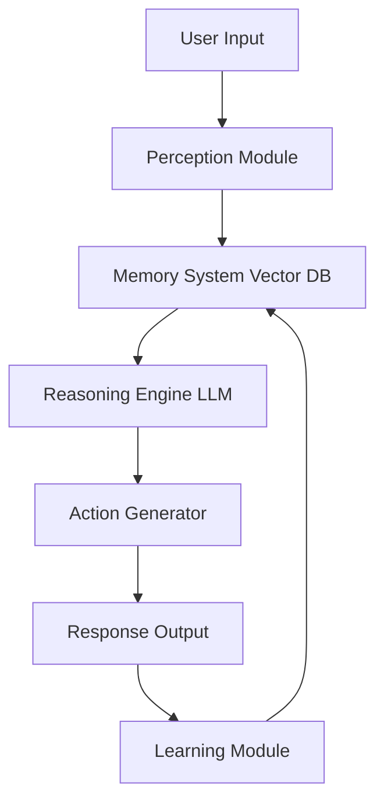

# 🤖 AI Agents and RAG Architecture

## Understanding AI Agents

### What is an AI Agent?

An **AI Agent** is an autonomous system that:
- **Perceives** its environment through sensors/inputs
- **Reasons** about the information using AI models
- **Acts** to achieve specific goals
- **Learns** from interactions and feedback

### Types of AI Agents

#### 1. Reactive Agents
- Respond directly to current inputs
- No memory of past interactions
- Fast but limited reasoning

#### 2. Deliberative Agents
- Plan actions based on goals
- Maintain internal world model
- Can reason about future consequences

#### 3. Learning Agents
- Improve performance over time
- Adapt to new environments
- Our RAG system is a learning agent

#### 4. Multi-Agent Systems
- Multiple agents working together
- Coordination and communication
- Distributed problem solving

## Our RAG Agent Architecture

### Agent Components



### 1. Perception Module (`main.py`)
**Function**: Processes user queries and converts them to searchable format

```python
def perceive_environment(user_input):
    """
    Agent's perception system
    - Input: Natural language query
    - Processing: Text preprocessing and validation
    - Output: Structured query for retrieval
    """
    # Sanitize input
    cleaned_input = sanitize_input(user_input)
    
    # Intent classification (future enhancement)
    intent = classify_intent(cleaned_input)
    
    # Extract entities (future enhancement)
    entities = extract_entities(cleaned_input)
    
    return {
        "query": cleaned_input,
        "intent": intent,
        "entities": entities
    }
```

### 2. Memory System (`vector.py`)
**Function**: Long-term memory storage and retrieval

```python
class AgentMemory:
    """
    Agent's memory system using vector database
    - Episodic Memory: Specific review instances
    - Semantic Memory: General knowledge about restaurant
    - Working Memory: Current conversation context
    """
    
    def __init__(self):
        self.episodic_memory = vector_store  # Review episodes
        self.semantic_memory = {}  # Aggregated knowledge
        self.working_memory = []  # Conversation history
    
    def retrieve_memories(self, query):
        """Retrieve relevant memories based on query"""
        return self.episodic_memory.similarity_search(query)
    
    def store_interaction(self, query, response, feedback=None):
        """Store new interaction for learning"""
        interaction = {
            "timestamp": time.time(),
            "query": query,
            "response": response,
            "feedback": feedback
        }
        self.working_memory.append(interaction)
```

### 3. Reasoning Engine (LLM Integration)
**Function**: Processes retrieved information and generates responses

```python
class ReasoningEngine:
    """
    Agent's reasoning capabilities
    - Analogical Reasoning: Compare similar reviews
    - Causal Reasoning: Understand cause-effect relationships
    - Common Sense Reasoning: Apply world knowledge
    """
    
    def __init__(self, llm_model):
        self.llm = llm_model
        self.reasoning_patterns = {
            "comparison": "Compare and contrast the following reviews...",
            "summary": "Summarize the key points from these reviews...",
            "recommendation": "Based on the reviews, recommend..."
        }
    
    def reason_about(self, context, query, reasoning_type="summary"):
        """Apply reasoning to generate response"""
        prompt_template = self.reasoning_patterns[reasoning_type]
        
        # Construct reasoning prompt
        full_prompt = f"""
        {prompt_template}
        
        Context: {context}
        Query: {query}
        
        Apply logical reasoning to provide a comprehensive answer.
        """
        
        return self.llm.invoke(full_prompt)
```

### 4. Action Generator
**Function**: Formats and delivers responses to users

```python
class ActionGenerator:
    """
    Agent's action planning and execution
    - Response formatting
    - Confidence scoring
    - Follow-up suggestions
    """
    
    def generate_response(self, reasoning_output, confidence_score):
        """Generate final response with metadata"""
        return {
            "response": reasoning_output,
            "confidence": confidence_score,
            "sources": self.get_source_reviews(),
            "suggestions": self.generate_followups()
        }
```

## RAG (Retrieval-Augmented Generation) Deep Dive

### RAG vs Traditional Approaches

| Approach | Knowledge Source | Accuracy | Freshness | Cost |
|----------|------------------|----------|-----------|------|
| **Traditional LLM** | Training data only | Medium | Static | Low |
| **Fine-tuning** | Training + custom data | High | Static | High |
| **RAG** | Dynamic retrieval | High | Dynamic | Medium |

### RAG Benefits

#### 1. **Factual Accuracy**
- Grounds responses in actual documents
- Reduces hallucination
- Provides source attribution

#### 2. **Dynamic Knowledge**
- Updates without retraining
- Incorporates new information
- Real-time data integration

#### 3. **Cost Efficiency**
- No need for expensive fine-tuning
- Smaller base models can work well
- Scalable to large knowledge bases

### RAG Pipeline Stages

#### Stage 1: Document Preparation
```python
def prepare_documents(raw_documents):
    """
    Document preprocessing pipeline
    1. Text extraction and cleaning
    2. Chunking for optimal retrieval
    3. Metadata extraction
    4. Quality filtering
    """
    processed_docs = []
    
    for doc in raw_documents:
        # Clean and normalize text
        cleaned_text = clean_text(doc.content)
        
        # Extract metadata
        metadata = extract_metadata(doc)
        
        # Create document chunks
        chunks = chunk_document(cleaned_text)
        
        for chunk in chunks:
            processed_docs.append(Document(
                page_content=chunk,
                metadata=metadata
            ))
    
    return processed_docs
```

#### Stage 2: Embedding Generation
```python
def generate_embeddings(documents, embedding_model):
    """
    Convert documents to vector representations
    """
    embeddings = []
    
    for doc in documents:
        # Generate dense vector representation
        vector = embedding_model.embed_query(doc.page_content)
        
        embeddings.append({
            "vector": vector,
            "document": doc,
            "dimension": len(vector)
        })
    
    return embeddings
```

#### Stage 3: Vector Storage and Indexing
```python
def build_vector_index(embeddings):
    """
    Create efficient search index
    """
    # Initialize vector database
    vector_db = Chroma(embedding_function=embedding_model)
    
    # Batch insert for efficiency
    batch_size = 100
    for i in range(0, len(embeddings), batch_size):
        batch = embeddings[i:i + batch_size]
        vector_db.add_documents(batch)
    
    # Build search index (HNSW)
    vector_db.build_index()
    
    return vector_db
```

#### Stage 4: Query Processing and Retrieval
```python
def retrieve_relevant_context(query, vector_db, k=5):
    """
    Retrieve most relevant documents for query
    """
    # Generate query embedding
    query_vector = embedding_model.embed_query(query)
    
    # Perform similarity search
    similar_docs = vector_db.similarity_search_with_score(
        query, k=k
    )
    
    # Filter by relevance threshold
    relevant_docs = [
        doc for doc, score in similar_docs 
        if score > RELEVANCE_THRESHOLD
    ]
    
    return relevant_docs
```

#### Stage 5: Context Integration and Generation
```python
def generate_rag_response(query, retrieved_docs, llm):
    """
    Generate response using retrieved context
    """
    # Format context from retrieved documents
    context = format_context(retrieved_docs)
    
    # Create prompt with context
    prompt = f"""
    Based on the following context, answer the user's question.
    
    Context:
    {context}
    
    Question: {query}
    
    Answer:
    """
    
    # Generate response
    response = llm.invoke(prompt)
    
    return {
        "answer": response,
        "sources": [doc.metadata for doc in retrieved_docs],
        "context_used": len(retrieved_docs)
    }
```

## Advanced Agent Capabilities

### 1. Multi-Turn Conversations
```python
class ConversationalAgent:
    """
    Agent with conversation memory and context tracking
    """
    
    def __init__(self):
        self.conversation_history = []
        self.context_window = 5  # Remember last 5 exchanges
    
    def process_with_history(self, current_query):
        """Process query with conversation context"""
        # Get relevant history
        recent_context = self.conversation_history[-self.context_window:]
        
        # Enhance query with context
        enhanced_query = self.enhance_with_context(
            current_query, recent_context
        )
        
        # Process normally
        response = self.process_query(enhanced_query)
        
        # Update history
        self.conversation_history.append({
            "query": current_query,
            "response": response,
            "timestamp": time.time()
        })
        
        return response
```

### 2. Intent Classification
```python
class IntentClassifier:
    """
    Classify user intent for better response generation
    """
    
    INTENT_PATTERNS = {
        "food_query": ["food", "dish", "taste", "flavor", "menu"],
        "service_query": ["service", "staff", "waiter", "customer"],
        "ambiance_query": ["atmosphere", "ambiance", "environment"],
        "price_query": ["price", "cost", "expensive", "cheap", "value"],
        "recommendation": ["recommend", "suggest", "best", "top"]
    }
    
    def classify_intent(self, query):
        """Classify query intent"""
        query_lower = query.lower()
        
        intent_scores = {}
        for intent, keywords in self.INTENT_PATTERNS.items():
            score = sum(1 for keyword in keywords if keyword in query_lower)
            intent_scores[intent] = score
        
        # Return highest scoring intent
        return max(intent_scores, key=intent_scores.get)
```

### 3. Response Personalization
```python
class PersonalizationEngine:
    """
    Personalize responses based on user preferences
    """
    
    def __init__(self):
        self.user_profiles = {}
    
    def update_user_profile(self, user_id, interaction):
        """Update user preferences based on interactions"""
        if user_id not in self.user_profiles:
            self.user_profiles[user_id] = {
                "preferences": {},
                "interaction_count": 0,
                "topics_of_interest": []
            }
        
        profile = self.user_profiles[user_id]
        profile["interaction_count"] += 1
        
        # Extract preferences from interaction
        self.extract_preferences(profile, interaction)
    
    def personalize_response(self, response, user_id):
        """Personalize response for user"""
        if user_id not in self.user_profiles:
            return response
        
        profile = self.user_profiles[user_id]
        
        # Adjust tone and content based on preferences
        personalized = self.adjust_response_style(response, profile)
        
        return personalized
```

### 4. Learning and Adaptation
```python
class LearningAgent:
    """
    Agent that learns from user feedback
    """
    
    def __init__(self):
        self.feedback_history = []
        self.performance_metrics = {}
    
    def collect_feedback(self, query, response, user_feedback):
        """Collect and store user feedback"""
        feedback_entry = {
            "query": query,
            "response": response,
            "rating": user_feedback.get("rating"),
            "comments": user_feedback.get("comments"),
            "timestamp": time.time()
        }
        
        self.feedback_history.append(feedback_entry)
        self.update_metrics(feedback_entry)
    
    def adapt_behavior(self):
        """Adapt agent behavior based on feedback"""
        # Analyze feedback patterns
        low_rated_responses = [
            f for f in self.feedback_history 
            if f["rating"] < 3
        ]
        
        # Identify improvement areas
        improvement_areas = self.analyze_failures(low_rated_responses)
        
        # Adjust parameters
        self.adjust_retrieval_parameters(improvement_areas)
        self.adjust_generation_parameters(improvement_areas)
```

## Multi-Agent Architecture (Future Enhancement)

### Specialized Agents
```python
class SpecializedAgentSystem:
    """
    System with multiple specialized agents
    """
    
    def __init__(self):
        self.agents = {
            "food_expert": FoodExpertAgent(),
            "service_analyst": ServiceAnalysisAgent(),
            "sentiment_analyzer": SentimentAgent(),
            "coordinator": CoordinatorAgent()
        }
    
    def process_complex_query(self, query):
        """Route query to appropriate specialized agents"""
        # Determine which agents should handle the query
        relevant_agents = self.agents["coordinator"].route_query(query)
        
        # Collect responses from relevant agents
        agent_responses = {}
        for agent_name in relevant_agents:
            agent_responses[agent_name] = self.agents[agent_name].process(query)
        
        # Synthesize final response
        final_response = self.agents["coordinator"].synthesize_responses(
            agent_responses, query
        )
        
        return final_response
```

This comprehensive overview explains how AI agents work and how RAG enhances their capabilities, providing both theoretical understanding and practical implementation details.
