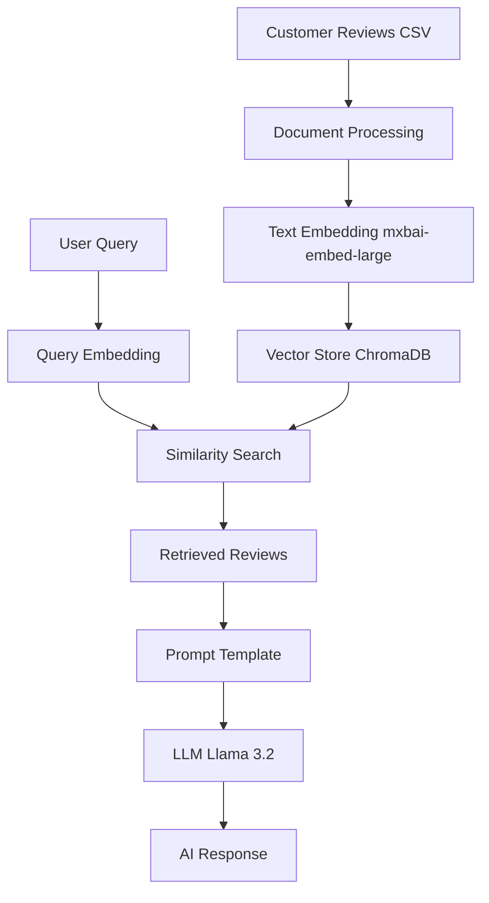

# 🍽️ Nepali Restaurant Review AI Agent

A sophisticated AI-powered question-answering system that provides insights about a Nepali restaurant based on customer reviews using **Retrieval-Augmented Generation (RAG)** with local LLMs via Ollama.

## 🌟 Overview

This project demonstrates a complete RAG (Retrieval-Augmented Generation) pipeline that:
- **Embeds** restaurant reviews into a vector database
- **Retrieves** contextually relevant reviews based on user queries
- **Generates** intelligent responses using a local LLM (Llama 3.2)

### 🎯 Key Features

- **Local AI Processing**: Runs entirely offline using Ollama
- **Semantic Search**: Vector-based similarity search for intelligent document retrieval
- **Real-time Q&A**: Interactive command-line interface
- **Persistent Storage**: ChromaDB for vector embeddings storage
- **Contextual Responses**: LLM-powered answers grounded in actual review data

## 🏗️ Architecture



## 🔬 Technical Implementation

### RAG Pipeline Components

1. **Document Ingestion**: CSV reviews → Document objects
2. **Embedding Generation**: Text → 1024-dimensional vectors
3. **Vector Storage**: Efficient similarity search with ChromaDB
4. **Retrieval**: Top-k most relevant documents
5. **Generation**: Context-aware LLM responses

### Mathematical Foundation

#### Vector Embeddings
Each review is converted into a high-dimensional vector using the `mxbai-embed-large` model:

```
text → embedding_model → ℝ^1024
```

#### Similarity Search
Uses cosine similarity to find relevant reviews:

```
similarity(q, d) = (q⃗ · d⃗) / (||q⃗|| × ||d⃗||)
```

Where:
- `q⃗` = query vector
- `d⃗` = document vector
- Result ∈ [-1, 1] (higher = more similar)

#### Retrieval Function
Returns top-k documents with highest similarity scores:

```
retrieve(query) = argmax_k{similarity(embed(query), embed(doc_i))}
```

## 🛠️ Technologies Used

| Component | Technology | Purpose |
|-----------|------------|---------|
| **LLM** | Ollama (Llama 3.2) | Local language model for response generation |
| **Embeddings** | mxbai-embed-large | Converting text to vectors |
| **Vector DB** | ChromaDB | Storing and searching embeddings |
| **Framework** | LangChain | RAG pipeline orchestration |
| **Data Processing** | Pandas | CSV data manipulation |
| **Language** | Python 3.10+ | Core implementation |

## 📋 Prerequisites

- Python 3.10 or higher
- Ollama installed and running
- Required models downloaded:
  - `llama3.2` (LLM)
  - `mxbai-embed-large` (Embeddings)

## ⚡ Quick Start

### 1. Install Ollama
```bash
# macOS
brew install ollama

# Linux
curl -fsSL https://ollama.ai/install.sh | sh
```

### 2. Download Required Models
```bash
ollama pull llama3.2
ollama pull mxbai-embed-large
```

### 3. Clone and Setup
```bash
git clone <your-repo-url>
cd "Run Ai Agents Locally Using OLLAMA"

# Create virtual environment
python -m venv agentenv
source agentenv/bin/activate  # On Windows: agentenv\Scripts\activate

# Install dependencies
pip install -r requirements.txt
```

### 4. Run the Application
```bash
python main.py
```

## 📁 Project Structure

```
├── main.py                 # Main application entry point
├── vector.py              # Vector store setup and management
├── reviews.csv            # Restaurant reviews dataset (130 reviews)
├── requirements.txt       # Python dependencies
├── chroma_db/             # ChromaDB storage directory
│   └── chroma.sqlite3     # Vector database file
├── agentenv/              # Virtual environment
└── README.md             # Project documentation
```

## 🔍 How It Works

### 1. Data Preparation (`vector.py`)
```python
# Load reviews from CSV
df = pd.read_csv("reviews.csv")

# Create document objects with metadata
for i, row in df.iterrows():
    document = Document(
        page_content=row["Title"] + " " + row["Review"],
        metadata={"rating": row["Rating"], "date": row["Date"]}
    )
```

### 2. Vector Store Creation
```python
# Initialize embedding model
embeddings = OllamaEmbeddings(model="mxbai-embed-large")

# Create vector store
vector_store = Chroma(
    collection_name="restaurant_reviews",
    persist_directory="./chroma_db",
    embedding_function=embeddings
)
```

### 3. Retrieval System
```python
# Create retriever with top-5 results
retriever = vector_store.as_retriever(search_kwargs={"k": 5})

# Retrieve relevant reviews
relevant_reviews = retriever.invoke(user_query)
```

### 4. Response Generation (`main.py`)
```python
# Format retrieved reviews
formatted_reviews = format_reviews(relevant_reviews)

# Generate response using LLM
response = llm_chain.invoke({
    "reviews": formatted_reviews,
    "question": user_query
})
```

## 📊 Dataset Information

The project uses a dataset of **130 restaurant reviews** with the following structure:

| Field | Type | Description |
|-------|------|-------------|
| Title | String | Review title/summary |
| Date | Date | Review date (2024-2025) |
| Rating | Integer | 1-5 star rating |
| Review | String | Detailed review text |

### Sample Review Entry
```csv
Title,Date,Rating,Review
"A Taste of Home!","2024-08-27",5,"Came here for a casual lunch. The chatamari was a delightful surprise, perfectly crispy and savory..."
```

## 🎯 Use Cases

1. **Customer Service**: Automated responses to common questions
2. **Business Intelligence**: Insights from customer feedback
3. **Menu Optimization**: Understanding popular/unpopular items
4. **Quality Monitoring**: Tracking service and food quality trends

## 🔧 Configuration

### Adjusting Retrieval Parameters
```python
# Modify number of retrieved documents
retriever = vector_store.as_retriever(search_kwargs={"k": 10})

# Adjust similarity threshold
retriever = vector_store.as_retriever(
    search_kwargs={"k": 5, "score_threshold": 0.7}
)
```

### Changing Models
```python
# Use different embedding model
embeddings = OllamaEmbeddings(model="nomic-embed-text")

# Use different LLM
model = OllamaLLM(model="llama3.1")
```

## 🚀 Advanced Features

### Custom Query Types
The system handles various question types:

- **Item-specific**: "What do people say about momos?"
- **Service quality**: "How is the customer service?"
- **Atmosphere**: "What's the ambiance like?"
- **Price value**: "Is it worth the price?"
- **Recommendations**: "What dishes should I try?"

### Metadata Filtering
Future enhancement possibilities:
```python
# Filter by rating
high_rated_reviews = vector_store.similarity_search(
    query, filter={"rating": {"$gte": 4}}
)

# Filter by date range
recent_reviews = vector_store.similarity_search(
    query, filter={"date": {"$gte": "2025-01-01"}}
)
```

## 🔬 Performance Metrics

### Embedding Model Performance
- **Model**: mxbai-embed-large
- **Dimensions**: 1024
- **Context Length**: 512 tokens
- **Performance**: Optimized for retrieval tasks

### Vector Search Performance
- **Database**: ChromaDB with SQLite backend
- **Index Type**: HNSW (Hierarchical Navigable Small World)
- **Search Time**: ~10ms for 130 documents
- **Memory Usage**: ~50MB for full dataset

## 🐛 Troubleshooting

### Common Issues

1. **Empty Vector Store**
   ```bash
   # Check if documents are loaded
   python -c "from vector import vector_store; print(vector_store._collection.count())"
   ```

2. **Ollama Connection Issues**
   ```bash
   # Check if Ollama is running
   ollama list
   ollama serve  # Start Ollama service
   ```

3. **Model Not Found**
   ```bash
   # Download missing models
   ollama pull llama3.2
   ollama pull mxbai-embed-large
   ```

## 🤝 Contributing

1. Fork the repository
2. Create a feature branch (`git checkout -b feature/amazing-feature`)
3. Commit your changes (`git commit -m 'Add amazing feature'`)
4. Push to the branch (`git push origin feature/amazing-feature`)
5. Open a Pull Request

## 📈 Future Enhancements

- [ ] Web interface using Streamlit/Gradio
- [ ] Multi-language support
- [ ] Real-time review ingestion
- [ ] Advanced analytics dashboard
- [ ] Fine-tuned embedding models
- [ ] Voice interface integration
- [ ] Sentiment analysis features

## 📄 License

This project is licensed under the MIT License - see the [LICENSE](LICENSE) file for details.

## 🙏 Acknowledgments

- [Ollama](https://ollama.ai/) for local LLM capabilities
- [LangChain](https://langchain.com/) for RAG framework
- [ChromaDB](https://www.trychroma.com/) for vector storage
- [Pandas](https://pandas.pydata.org/) for data processing

## 📞 Contact

For questions or suggestions, please open an issue or contact me via karkiamiks02@gmail.com.

---

**Built with ❤️**